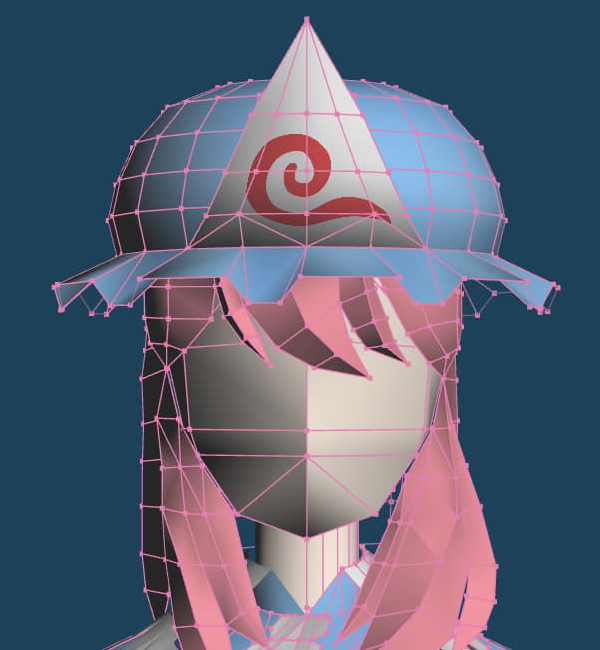
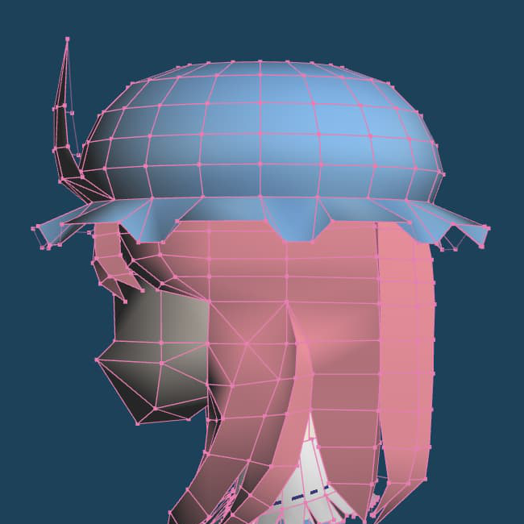
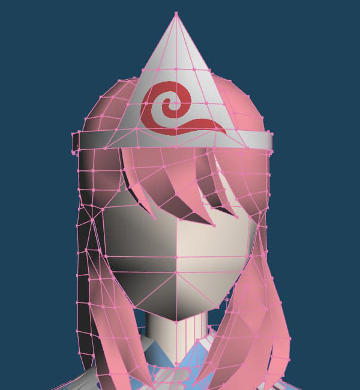
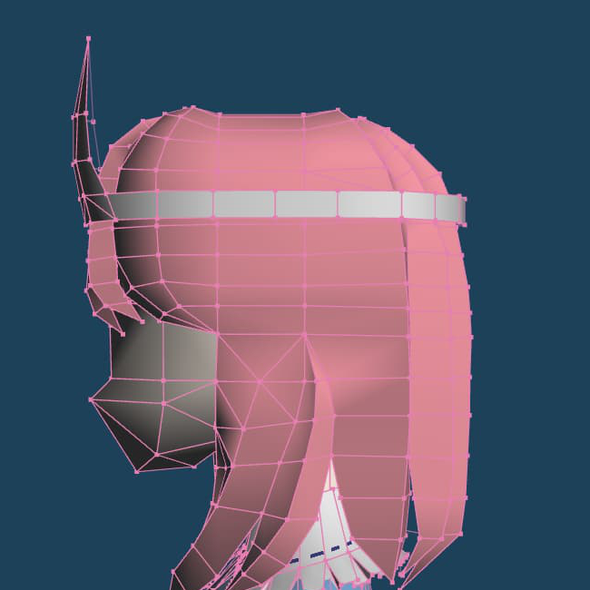

+++
date = '2026-03-03'
title = 'Papercraft Updates (March 2026)'
categories = ['Updates']
tags = ['Touhou Project','Yuyuko Saigyouji','WIP']
+++

I recently released my Stylist Papercraft, which you can find the [template and instructions here](https://chimeralens.net/p/%EF%B8%8Fstylist-papercraft%EF%B8%8F/).

Regarding Yuyuko, I'm still working on the textures and the hat. I'm trying both a hat and a headband, just to see how both turn out on the finished model.

      

I don't know what I'll work on next. I have a few ideas, but real life events can make it difficult to work on them.

But with all that said, I look forward to creating more papercrafts in the future!
